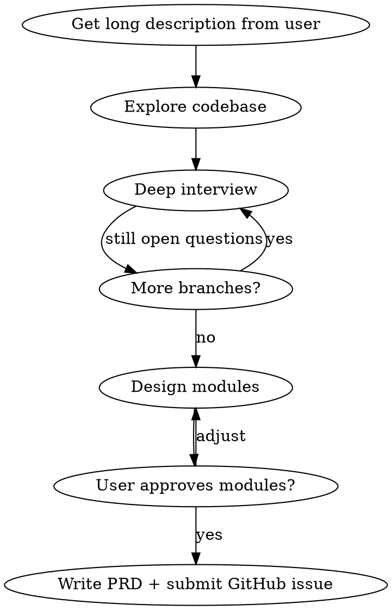

# Write a PRD

## Overview

Create a PRD through structured user interview, codebase exploration, and module design — then submit it as a GitHub issue. **Never draft the PRD early.** Earn it through the full process.

## The Process



## Step 1: Get a Long Description

Ask for a **long, detailed** description of:
- The problem they want to solve
- Any ideas for solutions

Do NOT ask multiple short questions. Ask for one comprehensive response.

## Step 2: Explore the Codebase

Before interviewing further, explore the repo to:
- Verify their assertions
- Understand current state of relevant code
- Identify what already exists vs. what needs to be built

**Do not skip this.** Generic PRDs come from skipping this step.

## Step 3: Deep Interview — Walk Every Branch

Interview the user **relentlessly** until you reach a shared understanding of every aspect. This is not a quick Q&A — it is a structured exploration.

**Walk down each branch of the design tree, one-by-one:**
- Resolve dependencies between decisions before moving on
- Don't move to the next topic until the current one is fully resolved
- Keep asking follow-up questions on each topic until it's exhausted

Topics to cover (not exhaustive — follow the problem):
- Who are the actors? What are their goals?
- What triggers this feature? What's the happy path? Edge cases?
- What data is created, read, updated, deleted?
- What are the failure modes? How should they be handled?
- What are the performance requirements?
- What are the security/auth requirements?
- How does this interact with existing features?
- What does success look like? How is it measured?
- What are the constraints (timeline, tech, team)?

**Red flags — do NOT move on if:**
- An answer is vague ("just make it work")
- A decision would affect other decisions downstream
- You haven't asked "what happens when X fails?"

## Step 4: Design the Modules

Sketch the major modules to build or modify. For each module:
- Name it and describe its responsibility
- Define its interface (what goes in, what comes out)
- Identify whether it is **deep** (lots of behavior, simple interface) or shallow

A **deep module** encapsulates a lot of functionality behind a simple, stable interface that rarely changes. Prefer deep modules.

Check with the user:
- Do these modules match their expectations?
- Which modules do they want tests written for?

## Step 5: Write the PRD

Use this template:

```markdown
## Problem Statement

[The problem from the user's perspective]

## Solution

[The solution from the user's perspective]

## User Stories

[Numbered list — be EXTREMELY extensive, cover all actors and edge cases]

1. As a <actor>, I want <feature>, so that <benefit>

## Implementation Decisions

[Modules, interfaces, architectural decisions, schema changes, API contracts]
[NO file paths or code snippets — they go stale]

## Testing Decisions

[What makes a good test (test external behavior, not implementation details)]
[Which modules will be tested]
[Prior art: similar tests in the codebase]

## Out of Scope

[Explicitly list what is NOT being built]

## Further Notes

[Anything else relevant]
```

## Step 6: Submit as a GitHub Issue

Post the completed PRD as a GitHub issue in the relevant repository.

## Anti-Patterns

| What you might do | What to do instead |
|---|---|
| "Want to move fast? Here's a draft" | Never short-circuit. Earn the PRD. |
| Ask 10 surface questions then draft | Walk each branch to resolution first |
| Skip codebase exploration | Always explore before deep interview |
| Produce generic PRD | Ground every section in codebase reality |
| End with "want me to adjust?" | Post the GitHub issue. That's the deliverable. |
| Leave open questions in PRD | Resolve them in the interview, not the doc |
